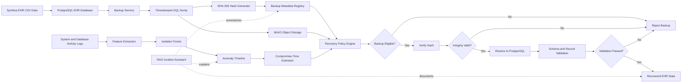
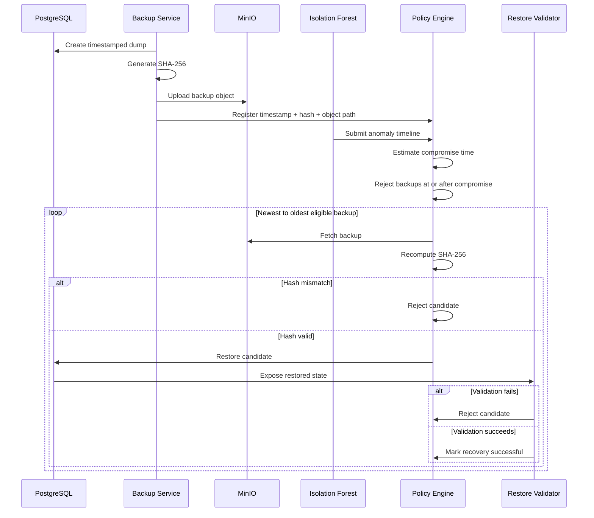

<div align="center">

# RescueCloud

### Compromise-Aware Backup Selection and Disaster Recovery for Healthcare EHR Systems

RescueCloud is a cloud-native research prototype that combines **database backup automation, integrity verification, anomaly detection, compromise-time estimation, and policy-driven restoration** to recover healthcare records from the latest trustworthy state—not merely the latest available backup.

[](https://www.postgresql.org/)
[](https://fastapi.tiangolo.com/)
[](https://www.docker.com/)
[](https://min.io/)
[](https://scikit-learn.org/)
[](https://synthetichealth.github.io/synthea/)

</div>

---

## 1. Why RescueCloud?

A conventional recovery system commonly follows this rule:

> Restore the most recent backup.

That rule becomes unsafe when an attacker has already modified the database, corrupted records, or tampered with the backup pipeline before the latest backup was created.

RescueCloud instead follows a compromise-aware policy:

> Restore the most recent backup that was created before the estimated compromise time and whose integrity can still be verified.

This changes recovery from a timestamp-only decision into a security-aware decision.

---

## 2. Research Problem

Healthcare systems require high availability, but availability alone is insufficient. A backup may be:

- recent but already contaminated,
- complete but maliciously altered,
- available but cryptographically unverifiable,
- technically restorable but logically inconsistent,
- or created after the first suspicious activity.

RescueCloud treats backup recovery as a constrained trust-selection problem.

Let:

- \(B_i\) be backup \(i\),
- \(t_i\) be its creation time,
- \(t_c\) be the estimated compromise time,
- \(H(B_i)\) be the computed SHA-256 hash,
- \(H_i^\*\) be the stored trusted hash,
- \(V(B_i)\) be the post-restore validation result.

A backup is eligible only when:

\[
t_i < t_c
\]

\[
H(B_i) = H_i^\*
\]

\[
V(B_i) = \text{valid}
\]

The selected restore point is:

\[
B^\* = \arg\max_{B_i} t_i
\]

subject to all eligibility constraints.

---

## 3. Main Contributions

RescueCloud combines several components into one end-to-end recovery framework:

1. **Timestamped PostgreSQL backups**  
   Every backup is associated with creation time and recovery metadata.

2. **Cryptographic integrity verification**  
   SHA-256 hashes are generated and rechecked before restoration.

3. **S3-compatible object storage**  
   Backups are stored in MinIO instead of remaining only on the database host.

4. **Unsupervised anomaly detection**  
   Isolation Forest detects unusual operational behaviour without requiring a fully labelled attack dataset.

5. **Compromise-time estimation**  
   Suspicious events are used to estimate the earliest point after which backups should no longer be trusted.

6. **Policy-driven backup rejection**  
   Backups created after the estimated compromise time are excluded automatically.

7. **Post-restore validation**  
   Recovery is accepted only after structural and logical checks pass.

8. **Explainable incident support**  
   The RAG layer can summarize logs, backup metadata, and recovery documentation, but it does not make the final restore decision.

---

## 4. Design Principle

RescueCloud separates deterministic recovery logic from generative assistance.

| Component | Responsibility | Decision authority |
|---|---|---|
| PostgreSQL | Stores EHR data | Authoritative data source |
| Backup service | Creates dump files | Deterministic |
| SHA-256 verifier | Detects file modification | Deterministic |
| Isolation Forest | Produces anomaly evidence | Advisory |
| Compromise estimator | Defines unsafe time window | Policy-based |
| Restore selector | Chooses latest eligible backup | Deterministic |
| RAG assistant | Explains alerts and recovery context | Non-authoritative |

The RAG module must never independently choose, approve, or execute a restore point.

---

## 5. Threat Model

RescueCloud is designed to study recovery under scenarios such as:

- unauthorized EHR record modification,
- abnormal write bursts,
- unusual login or access behaviour,
- ransomware-like database activity,
- backup corruption,
- altered backup files,
- delayed attack detection,
- and restoration from contaminated backups.

### Assumptions

The current prototype assumes:

- at least one pre-compromise backup remains available,
- trusted hash metadata has not been modified,
- MinIO and PostgreSQL are reachable during recovery,
- anomaly telemetry is available,
- and the recovery operator has permission to initiate restoration.

### Out of scope for the current prototype

- nation-state adversaries,
- hardware-level compromise,
- full cryptographic key-management infrastructure,
- certified hospital deployment,
- and guaranteed regulatory compliance.

---

## 6. End-to-End Architecture



---

## 7. Recovery Workflow



---

## 8. Repository Structure

```text
RescueCloud/
├── backend/
│   └── FastAPI services, APIs, orchestration, and recovery logic
│
├── data/
│   └── synthea/
│       └── csv/
│           └── Synthetic patient, condition, encounter, and clinical data
│
├── database/
│   └── PostgreSQL schemas, seed scripts, and database utilities
│
├── frontend/
│   └── HTML/CSS/JavaScript dashboard served through Nginx
│
├── ml/
│   └── Feature engineering, Isolation Forest training, and inference
│
├── rag/
│   └── Retrieval pipeline for incident explanations and recovery support
│
├── scripts/
│   └── Backup, hashing, restore, validation, and administrative scripts
│
├── docker-compose.yml
└── README.md
```

---

## 9. Technology Stack

| Layer | Technology | Role |
|---|---|---|
| EHR database | PostgreSQL | Stores structured healthcare records |
| Backend API | FastAPI | Exposes backup, detection, restore, and status APIs |
| Frontend | HTML, CSS, JavaScript | Operator dashboard |
| Reverse proxy | Nginx | Serves frontend and routes requests |
| Object storage | MinIO | Stores versioned backup objects |
| ML | scikit-learn | Isolation Forest anomaly detection |
| Integrity | SHA-256 | Verifies backup immutability |
| Synthetic data | Synthea | Generates privacy-safe EHR records |
| Retrieval | RAG | Explains incidents using project knowledge and logs |
| Deployment | Docker Compose | Runs the complete stack locally |

---

## 10. Data Layer

RescueCloud uses synthetic EHR records generated through Synthea to avoid exposing real patient information.

Typical entities include:

- patients,
- conditions,
- encounters,
- observations,
- medications,
- procedures,
- and care plans.

### Why synthetic data?

Real healthcare data is highly sensitive and regulated. Synthetic data enables:

- reproducible database experiments,
- controlled attack simulation,
- repeatable backup generation,
- safe restoration testing,
- and public demonstration without patient privacy risk.

---

## 11. Anomaly Detection Pipeline

The Isolation Forest module is used because attack telemetry is usually highly imbalanced and fully labelled healthcare cyberattack data is difficult to obtain.

### Example features

The implementation can derive features such as:

- failed login count,
- login frequency,
- access outside normal hours,
- number of database writes,
- rapid record modification,
- delete-to-insert ratio,
- backup frequency,
- file-integrity failures,
- unusual user activity,
- unusual IP activity,
- and query-volume spikes.

### Model output

For each observation \(x\), Isolation Forest produces an anomaly score:

\[
s(x) = 2^{-\frac{E(h(x))}{c(n)}}
\]

where:

- \(E(h(x))\) is the expected path length,
- \(c(n)\) normalizes the path length for sample size \(n\),
- and a larger score indicates stronger anomalous behaviour.

The anomaly score is evidence, not proof of compromise.

---

## 12. Compromise-Time Estimation

A single anomaly may be caused by legitimate behaviour. RescueCloud therefore estimates a compromise window rather than blindly trusting one alert.

A practical policy can combine:

- anomaly-score threshold,
- consecutive anomalous intervals,
- first integrity failure,
- sudden write-volume change,
- suspicious authentication event,
- and operator confirmation.

The estimated compromise time is the earliest timestamp at which the system is considered unsafe.

Backups created at or after this time are excluded.

---

## 13. Backup Metadata

Each backup should be associated with metadata similar to:

```json
{
  "backup_id": "ehr-2026-07-13T14-30-00Z",
  "created_at": "2026-07-13T14:30:00Z",
  "object_name": "ehr/ehr-2026-07-13T14-30-00Z.sql",
  "sha256": "stored-digest",
  "database": "rescuecloud",
  "status": "verified",
  "size_bytes": 0,
  "created_before_compromise": true
}
```

The exact schema may vary across implementations.

---

## 14. Restore-Point Selection Algorithm

```text
INPUT:
    backups
    estimated_compromise_time

SORT backups by creation_time descending

FOR each backup:
    IF backup.creation_time >= estimated_compromise_time:
        reject backup
        continue

    download backup from MinIO

    IF computed_sha256 != stored_sha256:
        reject backup
        continue

    attempt restore

    IF schema validation fails:
        reject backup
        continue

    IF record validation fails:
        reject backup
        continue

    return backup as selected restore point

RETURN no safe restore point found
```

This strategy prioritizes freshness while preserving trust constraints.

---

## 15. Validation Strategy

A successful database import does not guarantee a correct recovery.

RescueCloud should validate:

### Structural validity

- required tables exist,
- required columns exist,
- primary and foreign keys remain valid,
- schema version is compatible,
- and no mandatory relation is missing.

### Logical validity

- patient identifiers remain unique,
- conditions refer to existing patients,
- encounter timestamps are valid,
- record counts are within expected ranges,
- and critical fields are non-null.

### Recovery validity

- restored timestamp is before compromise,
- hash verification passed,
- database queries succeed,
- and the application can read recovered records.

---

## 16. RAG Incident Assistant

The `rag/` module can retrieve context from:

- incident logs,
- backup metadata,
- system documentation,
- recovery runbooks,
- validation reports,
- and previous alerts.

Example questions:

- “Why was the latest backup rejected?”
- “Which anomaly triggered the compromise window?”
- “What validation checks failed?”
- “Which clean backup was selected?”
- “What should the operator verify next?”

The assistant is intentionally separated from the recovery policy engine to reduce the risk of hallucinated recovery decisions.

---

## 17. Dashboard Capabilities

The RescueCloud dashboard can present:

- PostgreSQL health,
- backup history,
- MinIO object status,
- current anomaly score,
- detected suspicious events,
- estimated compromise time,
- eligible and rejected backups,
- integrity-verification results,
- restore progress,
- and validation outcome.

A strong UI should make the decision trail auditable rather than displaying only a final “restore completed” message.

---

## 18. Quick Start

### Prerequisites

- Git
- Docker
- Docker Compose

### Clone

```bash
git clone https://github.com/shrimanasa/RescueCloud.git
cd RescueCloud
```

### Validate the Compose configuration

```bash
docker compose config
```

### Build and start

```bash
docker compose up --build
```

### Run in detached mode

```bash
docker compose up --build -d
```

### View logs

```bash
docker compose logs -f
```

### Stop services

```bash
docker compose down
```

### Remove containers and volumes

```bash
docker compose down -v
```

Use the final command carefully because it removes persistent Docker volumes.

---

## 19. API Exploration

After the backend starts, FastAPI normally exposes interactive API documentation at:

```text
/docs
```

and an alternative documentation interface at:

```text
/redoc
```

The actual host port depends on the mapping defined in `docker-compose.yml`.

---

## 20. Experimental Evaluation Plan

A research-grade evaluation should measure more than model accuracy.

### Detection metrics

- precision,
- recall,
- F1-score,
- false-positive rate,
- anomaly-detection delay,
- and time-to-compromise estimation error.

### Backup metrics

- backup creation time,
- hash-generation time,
- upload latency,
- storage overhead,
- backup rejection rate,
- and backup-integrity failure rate.

### Recovery metrics

- Recovery Point Objective (RPO),
- Recovery Time Objective (RTO),
- restore completion time,
- validation time,
- clean-backup selection accuracy,
- and percentage of successfully recovered records.

### Reliability experiments

- corrupted backup,
- missing backup object,
- incorrect stored hash,
- delayed anomaly detection,
- multiple contaminated backups,
- MinIO unavailability,
- PostgreSQL restart,
- and incomplete restoration.

---

## 21. Security Hardening Required for Production

The current repository is a research prototype.

A production healthcare deployment would additionally require:

- encryption at rest and in transit,
- managed secrets,
- role-based access control,
- multi-factor authentication,
- immutable or write-once backups,
- offline backup replication,
- signed metadata,
- tamper-resistant audit logs,
- network segmentation,
- least-privilege service accounts,
- key rotation,
- SIEM integration,
- formal incident response,
- disaster-recovery drills,
- and legal/compliance review.

Do not store real patient data in the prototype without an approved security and compliance architecture.

---

## 22. Known Limitations

- Isolation Forest may generate false positives during legitimate traffic spikes.
- Compromise-time estimation is probabilistic.
- SHA-256 verifies file integrity but does not prove that the backup was clean when created.
- MinIO availability does not guarantee immutability.
- Synthetic data does not fully represent real hospital workflows.
- Recovery validation currently depends on the checks implemented by the project.
- RAG responses may be incomplete or inaccurate and must remain advisory.
- The framework is not a certified medical or disaster-recovery product.

---

## 23. Roadmap

- [ ] Real-time event streaming
- [ ] Signed backup metadata
- [ ] Immutable object-lock policy
- [ ] Multi-node PostgreSQL support
- [ ] Multi-hospital tenancy
- [ ] Automated ransomware simulation
- [ ] Advanced temporal compromise estimation
- [ ] Explainable anomaly attribution
- [ ] SIEM integration
- [ ] Kubernetes deployment
- [ ] Backup replication across regions
- [ ] Recovery benchmark suite
- [ ] Policy-based human approval workflow
- [ ] Formal threat-model document
- [ ] Automated integration tests

---

## 24. Suggested Demonstration Scenario

A complete demonstration can follow this sequence:

1. Load synthetic Synthea records into PostgreSQL.
2. Create several timestamped backups.
3. Store each backup and its SHA-256 hash.
4. Simulate abnormal database activity.
5. Detect anomalies with Isolation Forest.
6. Estimate the compromise time.
7. Show that newer backups are rejected.
8. Select the latest clean pre-attack backup.
9. Verify its hash.
10. Restore the database.
11. Validate recovered records.
12. Display the recovery explanation in the dashboard.

This demonstration clearly distinguishes RescueCloud from a normal backup application.

---

## 25. Research Direction

RescueCloud can be extended into a stronger research contribution by focusing on:

- uncertainty-aware compromise-time estimation,
- multi-signal anomaly fusion,
- trustworthy backup provenance,
- adaptive recovery policies,
- explainable backup rejection,
- and benchmarkable recovery quality.

The strongest research question is not:

> Can the system create and restore a backup?

It is:

> Can the system identify and restore the newest trustworthy state when the exact compromise time is uncertain?

---

## 26. Author

**Shri Manasa**  
GitHub: [@shrimanasa](https://github.com/shrimanasa)

---

## 27. Disclaimer

RescueCloud is intended for education, research, and controlled experimentation using synthetic data. It is not a certified healthcare product and must not be used for real patient-data recovery without appropriate engineering, security, regulatory, and clinical review.
